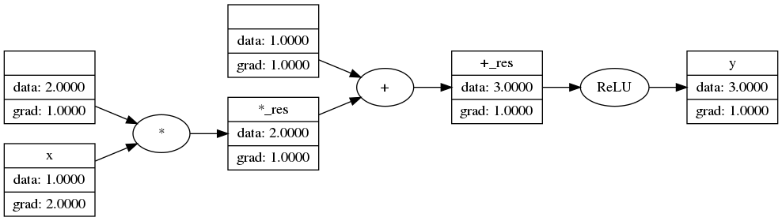
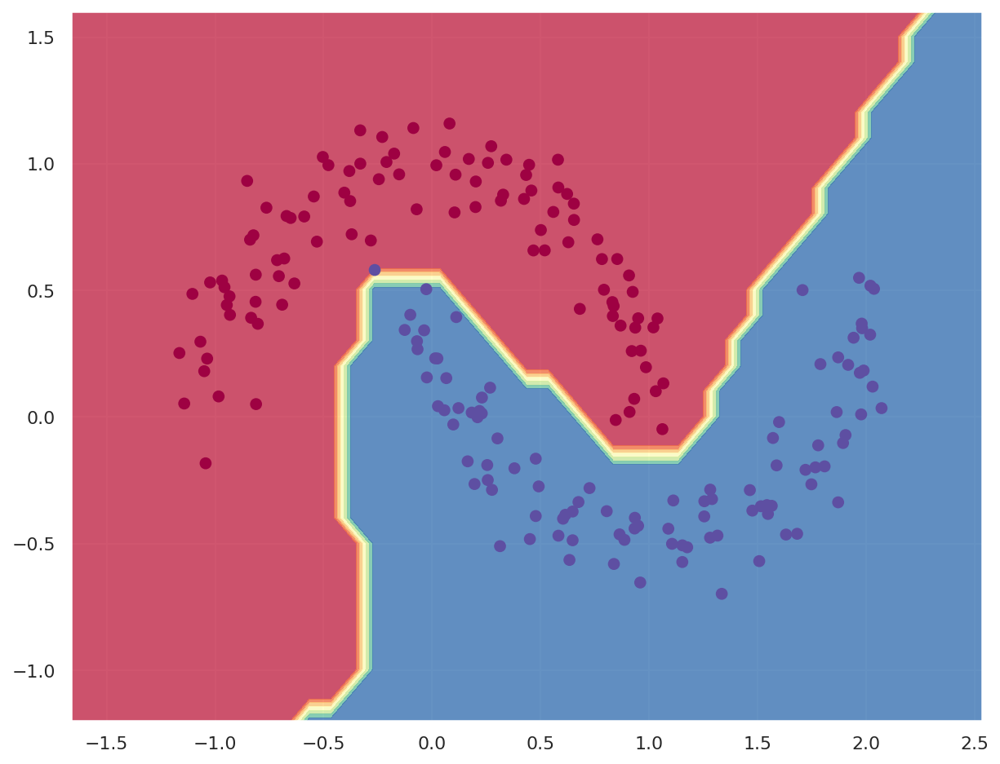

<h1 align="center">
  <br>
  picograd
  <br>
</h1>

<h4 align="center">A lightweight machine learning framework</h4>

[//]: # (<p align="center">)

[//]: # (  )

[//]: # (</p>)

<p align="center">
  <a href="#description">Description</a> •
  <a href="#features">Features</a> •
  <a href="#references">References</a> •
  <a href="#license">License</a>
</p>

## Description

A PyTorch-like lightweight deep learning framework written from scratch in Python.

The library has a built-in auto-differentiation engine that dynamically builds a computational graph. The framework is
built with basic features to train neural nets: optimizers, training API, data utilities, metrics
and loss functions.
Additional tools are developed to visualize forward computational graph.

## Features
- PyTorch-like auto-differentiation engine (dynamically constructed computational graph)
- [Keras](https://keras.io/)-like simple training API 
- Activations: ReLU, Sigmoid, tanh
- Optimizers: SGD, Adam
- Loss: Mean squared error
- Accuracy: Binary accuracy
- Computational graph visualizer (see example)

### Example Usage
```python
from picograd.engine import Var
from picograd.graph_viz import ForwardGraphViz

graph_builder = ForwardGraphViz()

x = Var(1.0, label='x')
y = (x * 2 + 1).relu(); y.label='y'
y.backward()

graph_builder.create_graph(y)
```
Output:



### Training MLP
```python
import numpy as np
import matplotlib
import matplotlib.pyplot as plt
import seaborn as sns
from sklearn.datasets import make_moons

from picograd.nn import MLP
from picograd.engine import Var
from picograd.data import BatchIterator
from picograd.trainer import Trainer
from picograd.optim import SGD, Adam
from picograd.metrics import binary_accuracy, mean_squared_error

# Generate moon-shaped, non-linearly separable data
x_train, y_train = make_moons(n_samples=200, noise=0.10, random_state=0)

model = MLP(in_features=2, layers=[16, 16, 1], activations=['relu', 'relu', 'linear']) # 2 hidden layers
print(model)
print(f"Number of parameters: {len(model.parameters())}")

optimizer = SGD(model.parameters(), lr=0.05)
data_iterator = BatchIterator(x_train, list(map(Var, y_train)))
trainer = Trainer(model, optimizer, loss=mean_squared_error, acc_metric=binary_accuracy)

history = trainer.fit(data_iterator, num_epochs=70, verbose=True)
```
Decision boundary:

## References

- Andrej Karpathy's [micrograd](https://github.com/karpathy/micrograd) library and intro explanation
  on [training neural nets](https://www.youtube.com/watch?v=VMj-3S1tku0&t=6246s&ab_channel=AndrejKarpathy), which is the
  foundation of **picograd**'s autograd engine.
- Baptiste Pesquet's [pyfit](https://github.com/bpesquet/pyfit) library, from which training API was borrowed.

## License

[MIT](LICENSE)
